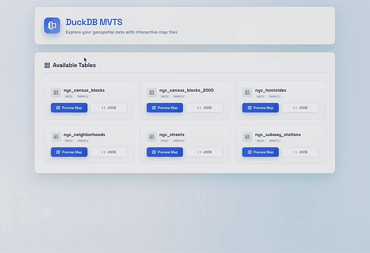

# DuckDB MVTS Extension

This DuckDB extension exposes geometry tables as Mapbox Vector Tiles (MVT) over an embedded local HTTP server. It lets you browse tables and render tiles in a built-in map viewer. It is designed for fast inspection and iteration on spatial data without setting up a separate tile server.

This repository is currently available via a private repository. We plan to make it available soon through the DuckDB Community Extension repo.

> WARNING: This repository is an early release. Expect bugs, breaking changes, and rough edges.
> This server is NOT suitable for production use cases. It is intended primarily for local inspection and testing.
> Feature requests and ideas are very welcome.

## Quickstart

Start DuckDB with unsigned extensions enabled and load the local build:

```sh
duckdb -unsigned
```

This extension targets DuckDB `v1.5.0`. The `GEOMETRY` type is built into DuckDB core in `v1.5`, but MVTS still relies on DuckDB Spatial functions to build tiles and compute bounds. Make sure the spatial extension is installed and loaded before using MVTS. Then set the custom repository and install the extension:

```sql
-- Install and load the spatial extension
INSTALL spatial;
LOAD spatial;
SET geometry_always_xy = true;

-- Set the custom repository, then install and load the DuckDB BigQuery extension
SET custom_extension_repository = 'http://storage.googleapis.com/hafenkran';
FORCE INSTALL mvts;
LOAD mvts;

-- Start the local HTTP server on port 8080
SELECT mvts_start(8080);
┌─────────────────────────────────────────┐
│            mvts_start(8080)             │
│                 varchar                 │
├─────────────────────────────────────────┤
│ Server started on http://localhost:8080 │
└─────────────────────────────────────────┘
```

Open the UI in your browser: http://localhost:8080/

> Note: The UI only lists tables that include a `GEOMETRY` column, and you must ensure your data uses the correct CRS (Web Mercator, `EPSG:3857`).

<div align="center">



</div>

## Geometry prep (example)

MVTS expects (!) geometries in Web Mercator (`EPSG:3857`). If your source table is in another CRS, you can also create a view on top that transforms the `GEOMETRY` column for tiling.

```sql
-- Example: transform WGS84 (EPSG:4326) to Web Mercator (EPSG:3857)
CREATE VIEW my_schema.my_table_3857 AS
SELECT
  * EXCLUDE geom,
  ST_Transform(geom, 'EPSG:4326', 'EPSG:3857') AS geom
FROM my_schema.my_table;
```

Use the view name in URLs (as `schema.table`), e.g. `my_schema.my_table_3857`.

## SQL functions

These functions control the local MVTS HTTP server from DuckDB.

```sql
-- Starts the server on 127.0.0.1:port and returns a status message.
-- Errors if the server is already running or the port is invalid.
SELECT mvts_start(8080);
┌─────────────────────────────────────────┐
│            mvts_start(8080)             │
│                 varchar                 │
├─────────────────────────────────────────┤
│ Server started on http://localhost:8080 │
└─────────────────────────────────────────┘

-- Returns a human-readable status message about whether the server is running.
SELECT mvts_status();
┌────────────────────────────────┐
│         mvts_status()          │
│            varchar             │
├────────────────────────────────┤
│ Server is running on port 8080 │
└────────────────────────────────┘

-- Stops the running server and returns a status message.
-- Errors if the server is not running.
SELECT mvts_stop();
┌───────────────────────────────────────────┐
│                mvts_stop()                │
│                  varchar                  │
├───────────────────────────────────────────┤
│ Server stopped (was running on port 8080) │
└───────────────────────────────────────────┘
```

## Tile behavior and schema rules

- Only tables with at least one `GEOMETRY` column are exposed.
- The first geometry column is used for tiling; additional geometry columns are ignored.
- Tables must be addressed as `schema.table` in URLs.
- Property columns are included; unsupported types are cast to `VARCHAR`.
- Empty tiles return `204 No Content`.

## QGIS connection (coming soon)

Direct QGIS connectivity is still experimental. Track current status in [duckdb-spatial#731](https://github.com/duckdb/duckdb-spatial/issues/731).

## HTTP API

The server provides a minimal REST surface intended for local usage and tooling integration.

- `GET /`
  - Renders a table overview page (HTML).
- `GET /tables`
  - Returns a JSON list of geometry tables.
- `GET /tables/{schema.table}`
  - Returns JSON metadata for a single table.
- `GET /tables/{schema.table}/viewer`
  - Interactive map preview for the table.
- `GET /tables/{schema.table}/tiles/{z}/{x}/{y}.pbf`
  - Vector tiles (MVT, layer id: `default`).

## Environment variables

These settings are read at runtime and allow you to control tile range and logging.

| Variable | Default | Description |
| --- | --- | --- |
| `MVTS_LOG_FILE` | (unset) | Write logs to the given file path when set. |
| `MVTS_MIN_ZOOM` | `0` | Minimum zoom level served. |
| `MVTS_MAX_ZOOM` | `22` | Maximum zoom level served. |
| `MVTS_MAX_FEATURES_PER_TILE` | `50000` | Hard cap for features per tile. |
| `MVTS_CLIP_GEOMETRIES` | `true` | Clip geometries when encoding MVT tiles. |

## Known limitations

- Geometry columns must currently be in Web Mercator (`EPSG:3857`) for MVTS tile generation.
- Zoom range enforcement is static via environment variables.
- Bounds are derived from the first geometry column only.
- Some property types are cast to `VARCHAR`, which may lose type information.

- This is a local HTTP server; it is not hardened for multi-tenant or public deployment.

## Building the Project

Clone the repository with submodules and build the extension:

```sh
git clone --recurse-submodules [<repo>](https://github.com/hafenkran/duckdb-mvts.git)
cd duckdb-mvts
make configure
make debug
```

To prepare a local test environment with the DuckDB CLI and NYC example data (downloaded into `testenv/`), run:

```sh
make prepare-testenv
```

By default, `make prepare-testenv` downloads DuckDB CLI `v1.5.0` to match this extension's target version.

The `debug-run` target will use `scripts/import_testenv.sql` and skip imports if the test data is missing.

To build and start the local server with the test environment, run:

```sh
make debug-run
```

## Project status

This repository is an early release. Bugs and breaking changes are expected. If you hit issues, please open a ticket with reproduction steps and a sample dataset if possible.

## License

MIT License - see [LICENSE](LICENSE).
